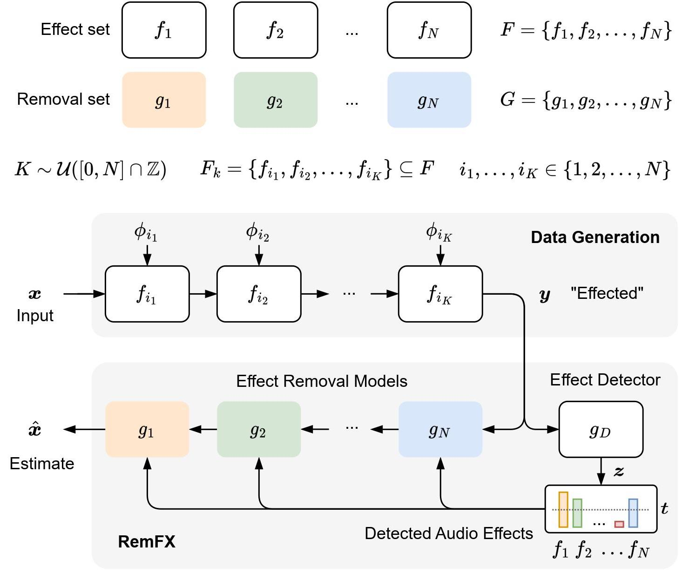

<div align="center">

# RemFx 
General Purpose Audio Effect Removal

[](https://arxiv.org/abs/1234.56789)
[](https://colab.research.google.com/drive/1LoLgL1YHzIQfILEayDmRUZzDZzJpD6rD)
[](https://zenodo.org/record/8187288)
[](https://opensource.org/licenses/Apache-2.0)


Listening examples can be found [here](https://csteinmetz1.github.io/RemFX/).




## Abstract
</div>

Although the design and application of audio effects is well understood, the inverse problem of removing these effects is significantly more challenging and far less studied. Recently, deep learning has been applied to audio effect removal; however, existing approaches have focused on narrow formulations considering only one effect or source type at a time. In realistic scenarios, multiple effects are applied with varying source content. This motivates a more general task, which we refer to as general purpose audio effect removal. We developed a dataset for this task using five audio effects across four different sources and used it to train and evaluate a set of existing architectures. We found that no single model performed optimally on all effect types and sources. To address this, we introduced <b>RemFX</b>, an approach designed to mirror the compositionality of applied effects. We first trained a set of the best-performing effect-specific
removal models and then leveraged an audio effect classification model to dynamically construct a graph of our models at inference. We found our approach to outperform single model baselines, although examples with many effects present remain challenging.

```bibtex
@inproceedings{rice2023remfx,
    title={General Purpose Audio Effect Removal},
    author={Rice, Matthew and Steinmetz, Christian J. and Fazekas, George and Reiss, Joshua D.},
    booktitle={IEEE Workshop on Applications of Signal Processing to Audio and Acoustics},
    year={2023}
}
```


## Setup
```
git clone https://github.com/mhrice/RemFx.git
cd RemFx
git submodule update --init --recursive
pip install -e . ./umx
pip install --no-deps hearbaseline
```
Due to incompatabilities with hearbaseline's dependencies (namely numpy/numba) and our other packages, we need to install hearbaseline with no dependencies.
<b>Please run the setup code before running any scripts.</b>
All scripts should be launched from the top level after installing.

## Usage
This repo can be used for many different tasks. Here are some examples. Ensure you have run the setup code before running any scripts.

### Run RemFX Detect on a single file
Here we will attempt to detect, then remove effects that are present in an audio file. For the best results, use a file from our [evaluation dataset](https://zenodo.org/record/8187288). We support detection and removal of the following effects: chorus, delay, distortion, dynamic range compression, and reverb.

First, we need to download the pytorch checkpoints from [zenodo](https://zenodo.org/record/8218621)
```
scripts/download_ckpts.sh
```
Then run the detect script. This repo contains an example file `example.wav` from our test dataset which contains 2 effects (chorus and delay) applied to a guitar.
```
scripts/remfx_detect.sh example.wav -o dry.wav
```
### Download the [General Purpose Audio Effect Removal evaluation datasets](https://zenodo.org/record/8187288)
We provide a script to download and unzip the datasets used in table 4 of the paper.
```
scripts/download_eval_datasets.sh
```

### Download the starter datasets

If you'd like to train your own model and/or generate a dataset, you can download the starter datasets using the following command:

```
python scripts/download.py vocalset guitarset dsd100 idmt-smt-drums
```
By default, the starter datasets are downloaded to `./data/remfx-data`. To change this, pass `--output_dir={path/to/datasets}` to `download.py`

Then set the dataset root:
```
export DATASET_ROOT={path/to/datasets}
```

## Training
Before training, it is important that you have downloaded the starter datasets (see above) and set `$DATASET_ROOT`.
This project uses the [pytorch-lightning](https://www.pytorchlightning.ai/index.html) framework and [hydra](https://hydra.cc/) for configuration management. All experiments are defined in `cfg/exp/`. To train with an existing experiment run
```
python scripts/train.py +exp={experiment_name}
```

At the end of training, the train script will automatically evaluate the test set using the best checkpoint (by validation loss). If epoch 0 is not finished, it will throw an error. To evaluate a specific checkpoint, run

```
python scripts/test.py +exp={experiment_name} +ckpt_path="{path/to/checkpoint}" render_files=False
```

### Experiments
Here are some selected experiment types from the paper, which use different datasets and configurations. See `cfg/exp/` for a full list of experiments and parameters.

| Experiment Type         | Config Name  | Example           |
| ----------------------- | ------------ | ----------------- |
| Effect-specific         | {effect}     | +exp=chorus       |
| Effect-specific + FXAug | {effect}_aug | +exp=chorus_aug   |
| Monolithic (1 FX)       | 5-1          | +exp=5-1          |
| Monolithic (<=5 FX)     | 5-5_full     | +exp=5-5_full     |
| Classifier              | 5-5_full_cls | +exp=5-5_full_cls |

To change the configuration, simply edit the experiment file, or override the configuration on the command line. A description of some of these variables is in the Experimental parameters section below.
You can also create a custom experiment by creating a new experiment file in `cfg/exp/` and overriding the default parameters in `config.yaml`.

### Logging
By default, training uses the Pytorch Lightning CSV Logger
Metrics and hyperparams will be logged in `./lightning_logs/{timestamp}`

[Weights and Biases](https://wandb.ai/) logging can also be used, and will log audio during training and testing. To use Weights and Biases, set `logger=wandb` in the config or command-line. Make sure you have an account and are logged in.

Then set the project and entity:
```
export WANDB_PROJECT={desired_wandb_project}
export WANDB_ENTITY={your_wandb_username}
```

The checkpoints will be saved in `./logs/ckpts/{timestamp}`

### Misc.
- By default, the dataset needed for the experiment is generated before training.
If you have generated the dataset separately (see Generate datasets used in the paper), be sure to set `render_files=False` in the config or command-line, and set `render_root={path/to/dataset}` if it is in a custom location.

- Training assumes you have a CUDA GPU. To train on CPU, set `accelerator=null` in the config or command-line.

- If training with the pretrained PANNs model, download the pretrained model from [here](https://zenodo.org/record/6332525) or run: `wget https://zenodo.org/record/6332525/files/hear2021-panns_hear.pth`. Place this in the root of the repo.


## Evaluate models on the General Purpose Audio Effect Removal evaluation datasets (Table 4 from the paper)
We provide a way to replicate the results of table 4 from our paper. First download the <b>General Purpose Audio Effect Removal evaluation datasets</b> (see above).
To use the pretrained RemFX model, download the checkpoints:
```
scripts/download_ckpts.sh
```
Then run the evaluation script. First select the RemFX configuration, between `remfx_oracle`, `remfx_detect`, and `remfx_all`. As a reminder, `remfx_oracle` uses the ground truth labels of the present effects to determine which removal models to apply, `remfx_detect` detects which effects are present, and `remfx_all` assumes all effects are present.
```
scripts/eval.sh remfx_detect 0-0
scripts/eval.sh remfx_detect 1-1
scripts/eval.sh remfx_detect 2-2
scripts/eval.sh remfx_detect 3-3
scripts/eval.sh remfx_detect 4-4
scripts/eval.sh remfx_detect 5-5
```
In this case the `N-N` refers to the number of effects present for each example in the dataset.


To eval a custom monolithic model, first train a model (see Training)
Then run the evaluation script, with the config used and checkpoint_path.
```
scripts/eval.sh distortion_aug 0-0 -ckpt "{path/to/checkpoint}"
```

To eval a custom effect-specific model as part of the inference chain, first train a model (see Training), then edit `cfg/exp/remfx_{desired_configuration}.yaml -> ckpts -> {effect}`. Select between `remfx_detect`, `remfx_oracle`, and `remfx_all`.
Then run the evaluation script.
```
scripts/eval.sh remfx_detect 0-0
```

The script assumes that RemFX_eval_datasets is in the top-level directory.
Metrics and hyperparams will be logged in `./lightning_logs/{timestamp}`

## Generate other datasets
The datasets used in the experiments are customly generated from the starter datasets. In short, for each training/val/testing example, we select a random 5.5s segment from one of the starter datasets and apply a random number of effects to it. The number of effects applied is controlled by the `num_kept_effects` and `num_removed_effects` parameters. The effects applied are controlled by the `effects_to_keep` and `effects_to_remove` parameters.

Before generating datasets, it is important that you have downloaded the starter datasets (see above) and set `$DATASET_ROOT`.

To generate one of the datasets used in the paper, use of the experiments defined in `cfg/exp/`.
For example, to generate the `chorus` FXAug dataset, which includes files with 5 possible effects, up to 4 kept effects (distortion, reverb, compression, delay), and 1 removed effects (chorus), run
```
python scripts/generate_dataset.py +exp=chorus_aug
```

See the Experimental parameters section below for a description of the parameters.
By default, files are rendered to `{render_root} / processed / {string_of_effects} / {train|val|test}`.

The dataset that is generated contains 8000 train examples, 1000 validation examples, and 1000 test examples. Each example is contained in a folder labeled by its id number (ex. 0-7999 for train examples) with 4 files like so:
```
.
└── train
    ├── 0
    │   ├── dry_effects.pt
    │   ├── input.wav
    │   ├── target.wav
    │   └── wet_effects.pt
    ├── 1
    │   └── ...
    ├── ...
    ├── 7999
    │   └── ...
```
### File descriptions
- dry_effects.pt = serialized PyTorch file that contains a list of the effects applied to the dry audio file
- input.wav = the wet audio file
- target.wav = the dry audio file
- wet_effects.pt = serialized PyTorch file that contains a list of the effects applied to the wet audio file

Note: if training, this process will be done automatically at the start of training. To disable this, set `render_files=False` in the config or command-line, and set `render_root={path/to/dataset}` if it is in a custom location.

## Experimental parameters
Some relevant dataset/training parameters descriptions
- `num_kept_effects={[min, max]}` range of <b> Kept </b> effects to apply to each file. Inclusive.
- `num_removed_effects={[min, max]}` range of <b> Removed </b> effects to apply to each file. Inclusive.
- `model={model}` architecture to use (see 'Effect Removal Models/Effect Classification Models').
- `effects_to_keep={[effect]}` Effects to apply but not remove (see 'Effects'). Used for FXAug.
- `effects_to_remove={[effect]}` Effects to remove (see 'Effects').
- `accelerator=null/'gpu'` Use GPU (1 device) (default: null).
- `render_files=True/False` Render files. Disable to skip rendering stage (default: True).
- `render_root={path/to/dir}`. Root directory to render files to (default: ./data).
- `datamodule.train_batch_size={batch_size}`. Change batch size (default: varies).
- `logger=wandb`. Use weights and biases logger (default: csv). Ensure you set the wandb environment variables (see training section).

### Effect Removal Models
- `umx`
- `demucs`
- `tcn`
- `dcunet`
- `dptnet`

### Effect Classification Models
- `cls_vggish`
- `cls_panns_pt`
- `cls_wav2vec2`
- `cls_wav2clip`

### Effects
- `delay`
- `distortion`
- `chorus`
- `compressor`
- `reverb`
